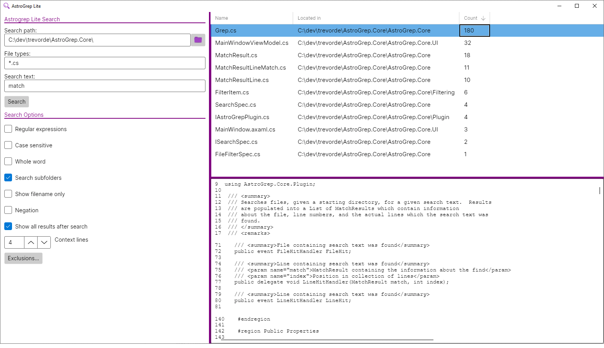

# AstroGrep.Core



This is a fork of [AstroGrep.Core](https://github.com/asherber/AstroGrep.Core), which, in turn, is a fork of
the original [AstroGrep repo](https://github.com/joshball/astrogrep). 

```text
AstroGrep is a nice Windows grep utility, good speed and customizability.
The app includes one assembly that is responsible for the actual searching.
I wanted to be able to use just that functionality, so I pulled out that code
and refactored a bit to remove references to other parts of the solution.
I also renamed the assembly from `libAstroGrep.dll` to `AstroGrep.Core.dll`.
```

## Additional work
* ported to .NET Core 6
* removed all Windows specific code
  * removed all encoding detection 
* ported to Linux
* added portable UI

## Sample usage:

```csharp
var searchSpec = new SearchSpec()
{
    StartDirectories = new List<string>() { @"c:\some\dir" },    
    SearchText = "fizzbin",
};

var filterSpec = new FileFilterSpec()
{
    FileFilter = "*.txt"
};

var grep = new Grep(searchSpec, filterSpec);
grep.Execute();
var matchResults = grep.MatchResults;
```

## Prerequisites
* .NET Core 6

## Getting started

```bash
# clone repository
git clone https://github.com/TrevorDArcyEvans/AstroGrep.Core.git

# build solution
cd AstroGrep.Core
dotnet build

# start UI
cd AstroGrep.Core.UI
dotnet run
```

## Further work
* ~~Linux desktop UI~~
* reinstate cross platform encoding detection
* ~~integrate [Avalon.Edit](https://github.com/AvaloniaUI/AvaloniaEdit)~~
* support excluding files + directories
* persist/restore settings

## Acknowledgements
* icons from [PngEgg](https://www.pngegg.com)
  * [folder](https://www.pngegg.com/en/png-fmqfv)
  * [magnifying glass](https://www.pngegg.com/en/png-babni)

